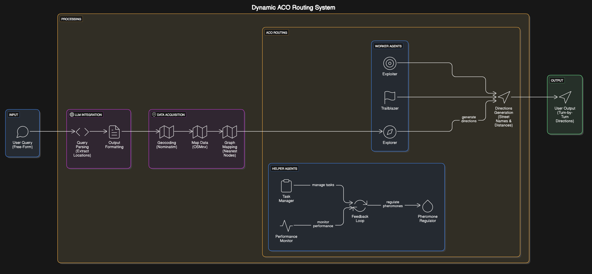

# Ant Colony Optimization (ACO) Agent with LLM Integration

This repository contains a dynamic, city‑agnostic routing system that uses free map data and an Ant Colony Optimization (ACO) algorithm to compute turn‑by‑turn directions. The system integrates with the Hugging Face LLM API to both parse free‑form queries and format human‑friendly directions. You can input a query like:

> "give me the shortest path from Boston Logan Airport to Northeastern University"

and receive a detailed, step‑by‑step route recommendation that includes street names and distances.

---

## System Overview

The system is organized into several key modules:

1. **`Query Processing & Extraction`:**  
   Uses an LLM (via the Hugging Face API) to extract the start and destination locations from a free‑form query.

2. **`Geocoding`:**  
   Converts the extracted location names into geographic coordinates using Nominatim (via Geopy).

3. **`Map Data Retrieval & Graph Construction`:**  
   Downloads a road network covering the area between the start and destination using OSMnx.

4. **`Graph Mapping`:**  
   Maps the geocoded coordinates to the nearest nodes in the road network graph.

5. **`ACO Routing Module`:**  
   Uses an Ant Colony Optimization (ACO) approach with multiple worker agents (Explorer, Trailblazer, Exploiter) and helper agents (Task Manager, Performance Monitor, Feedback Loop, Pheromone Regulator) to compute candidate routes and refine them.

6. **`Directions Generation`:**  
   Converts the best route (a list of node IDs) into human-friendly turn‑by‑turn directions by extracting street names and distances from the graph.

7. **`LLM Formatting`:**  
   The final route details are sent to the LLM API to produce polished, natural language directions.

8. **`User Output`:**  
   The formatted, human‑friendly directions are displayed in the command line.

---

## Architecture Diagram



# ACO Route Human-Friendly Directions System

## Running the Code

### File Structure

```
aco_routing_system/
│
├── aco_agents/
│   ├── __init__.py
│   ├── explorer.py          # Explorer agent class
│   ├── trailblazer.py       # Trailblazer agent class
│   ├── exploiter.py         # Exploiter agent class
│   └── helper_agents.py     # TaskManager, PerformanceMonitor, FeedbackLoop, PheromoneRegulator
│
├── utils/
│   ├── __init__.py
│   ├── geocoding.py         # geocode_location(), get_graph_for_route()
│   └── directions.py        # generate_directions()
│
├── llm/
│   ├── __init__.py
│   └── llm_interface.py     # HuggingFaceLLMInterface, LLMInterface, simulate_ACO()
│
├── main.py                  # Application entry point
├── requirements.txt         # Python dependencies
└── README.md               # Documentation
```


### Ensure Your Environment Variable is Set:

Make sure the `HF_API_TOKEN` environment variable is set as described above.

### Run the Script:

```bash
python main.py
```

### Enter Your Query:

When prompted, input a free-form query. For example:

```vbnet
Enter your query (for example, 'give me the shortest path from Boston Logan Airport to Northeastern University'):
> give me the shortest path from Boston Logan Airport to Northeastern University
```

### View the Output:

The system will process your query, compute the route using ACO, generate human-friendly turn-by-turn directions, and display the final output on the console.

---

## Code Structure

### Geocoding & Graph Construction:
- **`geocode_location(location)` (`geocoding.py`)**: Converts a location string to geographic coordinates.
- **`get_graph_for_route(start_coords, dest_coords)` (`geocoding.py`)**: Downloads the road network graph using OSMnx based on the start and destination coordinates.

### ACO Worker Agents:
- **Explorer (`explorer.py`)**: Generates candidate routes via random walks through the graph.
- **Trailblazer (`trailblazer.py`)**: Evaluates the generated routes and deposits pheromones on the promising paths.
- **Exploiter (`exploiter.py`)**: Refines candidate routes using a 2-opt algorithm to improve the path efficiency.

### Helper Agents:
- **TaskManager, PerformanceMonitor, FeedbackLoop, and PheromoneRegulator (`helper_agents.py`)**: Coordinate and manage the agent-based simulation, monitor performance, and adjust pheromone levels to optimize route selection.

### Directions Generation:
- **`generate_directions(graph, route)` (`directions.py`)**: Converts a sequence of node IDs representing a route into human-friendly, turn-by-turn directions with street names and distances.

### LLM Integration:
- **HuggingFaceLLMInterface (`llm_interface.py`)**: Interfaces with the Hugging Face API to parse user queries and format the final output.
- **LLMInterface (`llm_interface.py`)**: Orchestrates LLM parsing and integrates with the ACO system to produce the final human-readable route directions.
- **`simulate_ACO()` (`llm_interface.py`)**: Simulates the Ant Colony Optimization process, coordinating agent behavior and route evaluation.

### Module Initialization:
- **`__init__.py` (in `aco_agents/`, `utils/`, and `llm/` directories)**: Initializes the respective modules to allow imports across the system.

### Main Script:
- **Main Entry Point (`main.py`)**: Handles user input, invokes geocoding and route computation, manages ACO agents, and generates human-friendly directions.

### Requirements:
- **Dependencies (`requirements.txt`)**: Lists the required Python libraries and packages to run the application.

### Documentation:
- **Project Guide (`README.md`)**: Provides setup instructions, code structure explanations, and project details.


---

## Future Enhancements

- Improve LLM parsing accuracy by using advanced or instruction-tuned models.
- Enhance route evaluation with live traffic data.
- Integrate visualization tools to display the route on a map.
- Develop a web-based interface for broader accessibility.

---


## License

This project is open source and available under the MIT License.

Feel free to modify and extend the code or documentation as needed.
