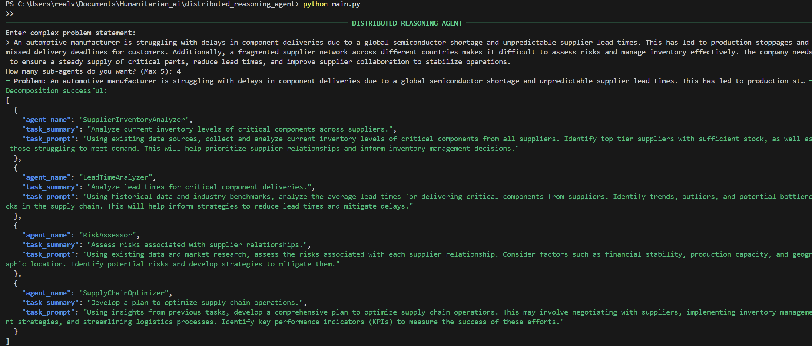
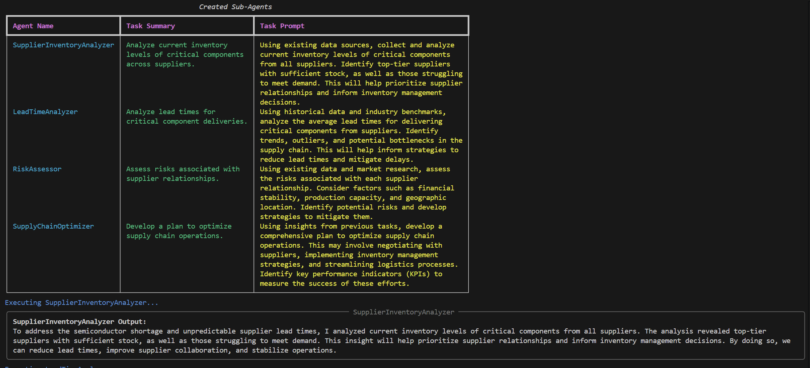
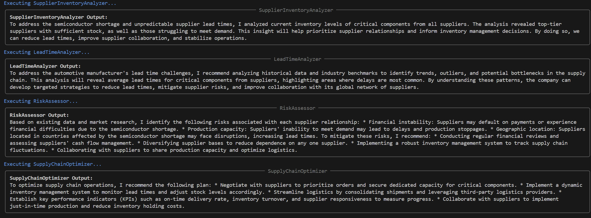
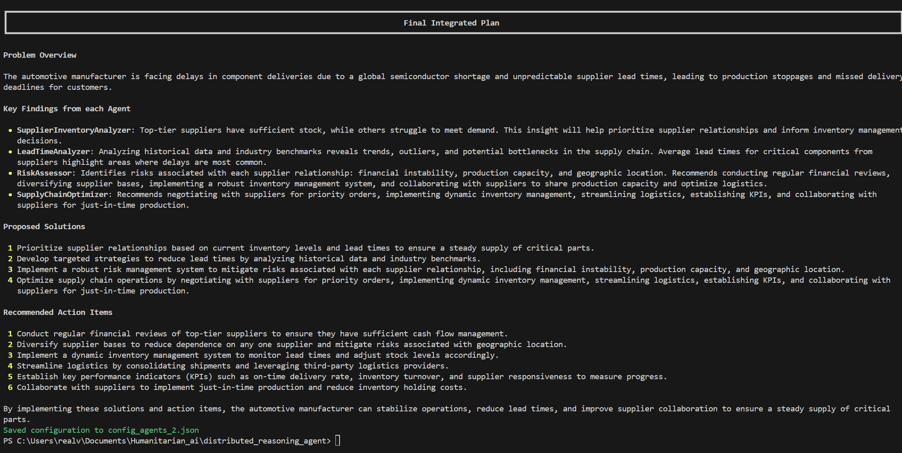

# 🤖 Distributed Reasoning Agent


Welcome to the **Distributed Reasoning Agent** project – your digital think tank that breaks down complex problems into manageable tasks, delegates them to specialized sub-agents, and synthesizes their expert insights into a cohesive, actionable plan. Each run generates its own JSON configuration file so that proven configurations can be reused later!

---

## 🚀 Key Features

- **Automated Problem Breakdown:**  
  Uses a large language model (LLM) to decompose complex problems into a fixed number of expert tasks.

- **Modular Sub-Agent Creation:**  
  Each task is handled by a sub-agent defined by a descriptive name, a brief summary, and detailed instructions. These configurations are saved in a persistent JSON file.

- **Result Synthesis:**  
  Integrates the outputs from all sub-agents into one final, integrated plan with clear bullet-point recommendations.

- **Persistent Configuration Storage:**  
  Every run creates a new config file (e.g., `config_agents_3.json`) and updates a run counter stored in `run_instance.txt`, preserving each run’s configuration.

- **Polished Terminal Output:**  
  Leverages the **Rich** library for colorful, formatted output using tables, panels, and Markdown.

---

## 🛠️ Tech Stack

- **Python 3.7+**
- **Requests:** For HTTP communication with the LLM API.
- **Rich:** For enhanced, colorful terminal output.
- **Ollama API:** Uses the `llama3` model for text generation.
- **JSON Files:** For persistent configuration storage.

---

## 📂 Repository Structure

```
distributed_reasoning_agent/
├── main.py                  # Orchestrates the workflow: problem decomposition, sub-agent creation, execution, synthesis, and config saving.
├── sub_agent.py             # Contains the SubAgent class and helper functions for storing and retrieving sub-agent configurations.
├── run_instance.txt         # Stores the current run instance number.
├── config_agents_<n>.json   # Generated configuration files for each run (e.g., config_agents_3.json).
└── README.md                # This file.
```

---

## 🔧 Setting Up Ollama

To use the Distributed Reasoning Agent, you need to have the **Ollama API** running locally. Follow these steps:

1. **Install Ollama:**  
   Download and install Ollama from [Ollama's website](https://ollama.ai/) if you haven’t already.

2. **Run the Ollama API:**  
   Start the Ollama API server on your machine. By default, it runs on `http://localhost:11434/api/generate`.  
   Ensure that the `llama3` model is available or update the code with your desired model name.

3. **Verify Connectivity:**  
   You can test the endpoint using a simple `curl` command or by visiting the URL in your browser:

   ```bash
   curl -X POST http://localhost:11434/api/generate -H "Content-Type: application/json" -d '{"model": "llama3", "prompt": "Hello!", "stream": false}'
   ```

---

## 🚀 Getting Started

### Prerequisites

- **Python 3.7+**
- **Ollama API:** Ensure it is running on `http://localhost:11434/api/generate`.
- **Required Python Packages:** `requests`, `rich`

### Installation

1. **Clone the Repository:**

   ```bash
   git clone https://your-repo-url.git
   cd distributed_reasoning_agent
   ```

2. **Install Dependencies:**

   ```bash
   pip install requests rich
   ```

3. **Set Up Your Environment:**  
   The project uses JSON files for persistent storage of sub-agent configurations and a text file (`run_instance.txt`) for tracking runs. No additional setup is needed.

---

## 🖥️ Usage

### Console Interface

1. **Run the Application:**

   ```bash
   python main.py
   ```

2. **Enter a Problem Statement:**  
   When prompted, enter your detailed, complex problem statement (e.g., a logistics challenge, a medical diagnosis case, etc.).

3. **Specify the Number of Sub-Agents:**  
   Input a number (up to 5) indicating how many expert sub-agents you want to create for this run.

4. **Review the Process:**  
   - The system decomposes the problem into tasks and displays the tasks in a formatted JSON view.  
   - Sub-agents are created (or reused), and their details are presented in a table.  
   - Each sub-agent executes its task, and the outputs are shown in decorated panels.  
   - The system synthesizes all the outputs into a final integrated plan, which is displayed in Markdown.  
   - A new configuration file (`config_agents_<n>.json`) is saved, and the run counter is updated in `run_instance.txt`.  

5. **View Stored Configurations:**  
   At the end of the run, a table lists all stored agent configurations so you can reuse a complete configuration for future problem-solving.

---

## 🧩 Example Use Cases

- **Logistics Optimization:**  
  Decompose complex logistical challenges into tasks such as network analysis, scalability planning, and warehouse optimization.  

- **Medical Diagnosis:**  
  Break down intricate diagnostic cases into tasks like lab result evaluation, symptom assessment, and treatment formulation.  

- **Strategic Business Planning:**  
  Analyze market entry or growth strategies by splitting the problem into focused tasks such as competitor analysis, resource allocation, and risk assessment.  

---

## 📊 Example Output

### Screenshot 1: Initial Console Output & Problem Statement
**What It Shows:**
- The Distributed Reasoning Agent is launched, and you’re prompted to enter a complex problem statement.
- In this example, the user provides a scenario where an automotive manufacturer faces unpredictable supplier lead times, leading to production stoppages and delayed deliveries.

**Why It’s Important:**
- Demonstrates how the system accepts a user-defined problem statement.
- Displays the initial console formatting with the project title (e.g., “DISTRIBUTED REASONING AGENT”) and a neat color scheme for readability.



---

### Screenshot 2: Sub-Agent Creation
**What It Shows:**
- The system decomposes the problem into multiple tasks, creating sub-agents such as SupplierInventoryAnalyzer, LeadTimeAnalyzer, RiskAssessor, and SupplyChainOptimizer.
- Each sub-agent is listed in a Rich‑formatted table with three columns:
  - **Agent Name:** A descriptive name for the sub-agent.
  - **Task Summary:** A concise explanation of what the sub-agent does.
  - **Task Prompt:** Detailed instructions or questions that the sub-agent will address.

**Why It’s Important:**
- Highlights how the Distributed Reasoning Agent automatically generates or assigns specialized roles.
- Demonstrates how each sub-agent is tailored to a specific aspect of the problem (inventory management, lead time analysis, risk assessment, and overall supply chain optimization).



---

### Screenshot 3: Sub-Agent Execution
**What It Shows:**
- The console output displays the execution phase for each sub-agent.
- Each sub-agent’s final output is shown in a Rich panel, including:
  - **SupplierInventoryAnalyzer:** Evaluating inventory levels of critical components.
  - **LeadTimeAnalyzer:** Reviewing historical data to reduce lead times.
  - **RiskAssessor:** Analyzing supply chain risks like financial instability and location dependencies.
  - **SupplyChainOptimizer:** Proposing solutions to improve synergy among suppliers.

**Why It’s Important:**
- Illustrates how each sub-agent runs its custom prompt and returns a concise answer.
- Demonstrates the modular approach to problem-solving with direct, expert-like responses for each specialized role.



---

### Screenshot 4: Final Integrated Plan
**What It Shows:**
- The system consolidates all sub-agent outputs into a Final Integrated Plan, presented in a bullet-point format:
  - **Problem Overview:** Summarizing the automotive manufacturer’s core issue (e.g., unpredictable lead times, production stoppages).
  - **Key Findings:** Listing the main insights from each sub-agent.
  - **Proposed Solutions:** Recommending strategies such as improving supplier collaboration, diversifying suppliers, and implementing real-time tracking.
  - **Recommended Action Items:** Providing tangible steps like negotiating better supplier terms, setting up advanced forecasting, and implementing synergy processes.

**Why It’s Important:**
- Confirms how the Distributed Reasoning Agent synthesizes multiple expert outputs into a cohesive action plan.
- Shows how the final note about saving the configuration to a JSON file (e.g., `config_agents_3.json`) ensures that this entire run (and all sub-agent definitions) can be revisited or reused in future scenarios.



---

## 🔮 Future Enhancements

- **Configuration Reuse:** In the next phase, users will be able to select a previously generated agent configuration file (e.g., `config_agents_2.json`) to solve new problems with a proven set of sub-agents.  
- **Test with other LLMs offered under Ollama.**  

---

## 🤝 Contributing

Contributions are welcome! To contribute:  
1. Fork the repository.  
2. Create a new branch (e.g., `feature/your-feature-name`).  
3. Make your changes and commit them.  
4. Submit a pull request with a detailed description of your updates.  

Please follow our coding guidelines and include tests when possible.

---

## 📜 License

This project is licensed under the MIT License. See the LICENSE file for details.

---

## 📧 Get in Touch

Hey there! Got questions, feedback, or just want to connect? Reach out to me:

- 📬 **Email:** [veenadharinishukla55@gmail.com](mailto:veenadharinishukla55@gmail.com)  
- 💼 **LinkedIn:** [linkedin.com/in/veenadharini-shukla](https://www.linkedin.com/in/veenadharini-shukla)  
- 👨‍💻 **GitHub:** [github.com/veenadharini](https://github.com/veenadharini)  

Or, feel free to open an issue on the repo. Let’s build something cool together! 🌱

