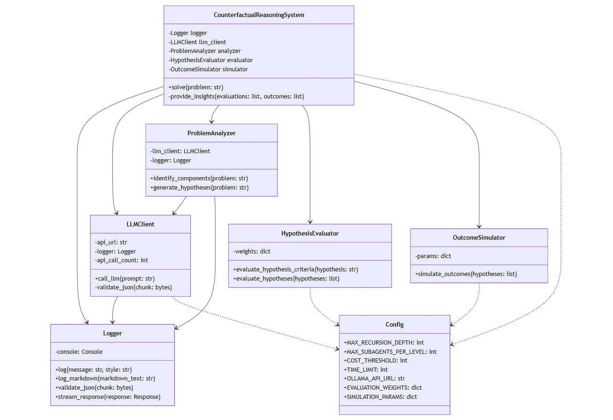
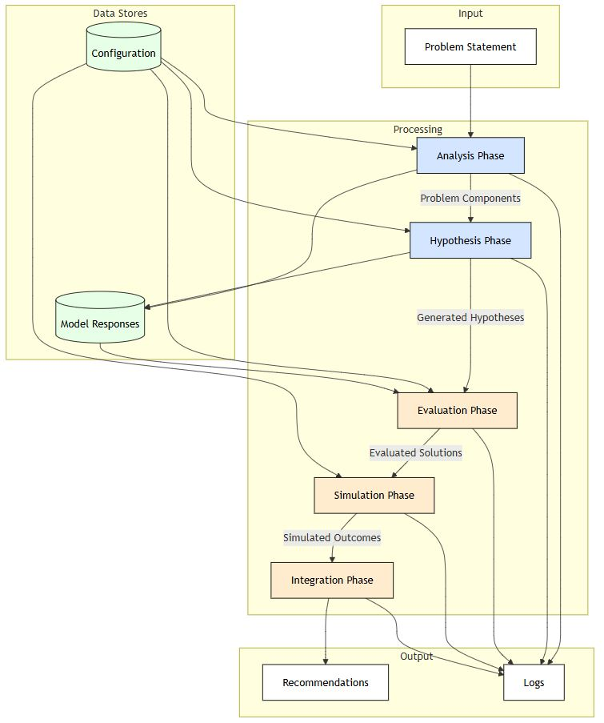
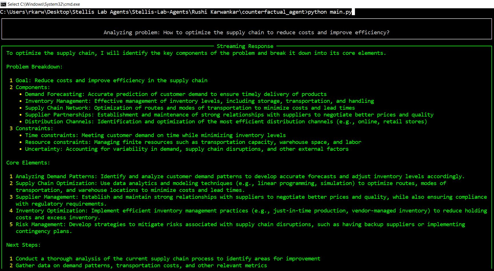
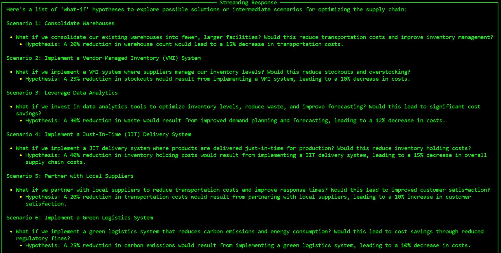
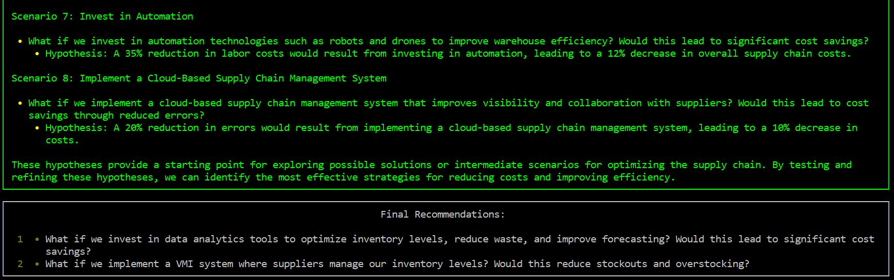

# 🤔 Counterfactual Reasoning Agent

A Python-based reasoning system that leverages Large Language Models (LLM) to perform counterfactual analysis, hypothesis generation, and solution evaluation. This system is designed for complex decision-making scenarios where multiple alternative solutions need to be carefully considered and evaluated.

## 🌟 Core Concept

The system implements a multi-step reasoning process:

1. Breaking down complex problems into manageable components
2. Generating "what-if" scenarios and hypotheses
3. Evaluating these hypotheses across multiple criteria
4. Simulating potential outcomes
5. Providing weighted recommendations based on combined analysis

## ✨ Features

### 🔍 Advanced Problem Analysis

- Systematic breakdown of complex problems into core components
- Natural language processing using LLM for understanding context
- Identification of key variables and dependencies
- Structured component relationship mapping

### 💡 Intelligent Hypothesis Generation

- LLM-powered generation of counterfactual scenarios
- "What-if" analysis for each identified component
- Exploration of multiple solution paths
- Context-aware hypothesis formulation

### ⚖️ Comprehensive Evaluation System

- Multi-criteria evaluation framework
- Weighted scoring system
- Real-time feasibility assessment
- Impact analysis across different dimensions

### 🎯 Sophisticated Outcome Simulation

- Probability-based outcome prediction
- Resource requirement analysis
- Risk factor consideration
- Market condition impact assessment

### 📝 Advanced Logging System

- Rich text formatting for better readability
- Real-time progress tracking
- Detailed error reporting
- Markdown-supported documentation

## 🚀 Installation

### Prerequisites

- Python 3.8 or higher
- Local Ollama installation
- Sufficient system memory (recommended: 8GB+)
- Stable internet connection

### Step-by-Step Installation

1. Clone the repository:

```bash
git clone https://github.com/rkarwankar/Stellis-Lab-Agents.git
cd Rushi Karwankar/counterfactual_agent
```

2. Create and activate a virtual environment (recommended):

```bash
python -m venv venv
source venv/bin/activate  # On Windows: venv\Scripts\activate
```

3. Install dependencies:

```bash
pip install -r requirements.txt
```

4. Configure Ollama:
   - Install Ollama following official documentation
   - Download the llama3.1 model
   - Ensure the Ollama service is running on port 11434

## 📁 Project Structure and Components

### Detailed File Structure

```
counterfactual_agent/
├── __init__.py
├── requirements.txt
├── src/
│   ├── __init__.py
│   ├── config.py          # System configuration and parameters
│   ├── logger.py          # Logging and output formatting
│   ├── llm_client.py      # LLM API interaction handling
│   ├── evaluator.py       # Hypothesis evaluation logic
│   ├── simulator.py       # Outcome simulation engine
│   └── analyzer.py        # Problem analysis and breakdown
└── main.py                # Main system orchestration
```

### Component Details

#### 🔍 ProblemAnalyzer (analyzer.py)

- **Purpose**: Breaks down complex problems into analyzable components
- **Key Methods**:
  - `identify_components()`: Extracts core problem elements
  - `generate_hypotheses()`: Creates potential solution scenarios
- **Features**:
  - Natural language processing
  - Context understanding
  - Component relationship mapping

#### ⚖️ HypothesisEvaluator (evaluator.py)

- **Purpose**: Evaluates generated hypotheses across multiple criteria
- **Evaluation Criteria**:
  - Feasibility (30% weight)
  - Impact (25% weight)
  - Cost efficiency (25% weight)
  - Implementation time (20% weight)
- **Features**:
  - Keyword-based analysis
  - Weighted scoring system
  - Multi-criteria assessment

#### 🎮 OutcomeSimulator (simulator.py)

- **Purpose**: Simulates potential outcomes of proposed solutions
- **Simulation Parameters**:
  - Implementation success rate (85%)
  - Resource availability (75%)
  - Market conditions (80%)
  - Risk factor (15%)
- **Features**:
  - Probability-based simulation
  - Complexity factor adjustment
  - Resource requirement analysis

#### 📝 Logger (logger.py)

- **Purpose**: Handles system output and error logging
- **Features**:
  - Rich text formatting
  - Live progress updates
  - JSON validation
  - Error tracking
  - Markdown rendering

#### 🤖 LLMClient (llm_client.py)

- **Purpose**: Manages LLM API interactions
- **Features**:
  - Automatic retry mechanism
  - Stream processing
  - Cost monitoring
  - Error handling
  - Response validation

## ⚙️ Configuration

### System Parameters (config.py)

```python
MAX_RECURSION_DEPTH = 3
MAX_SUBAGENTS_PER_LEVEL = 3
COST_THRESHOLD = 10
TIME_LIMIT = 600
OLLAMA_API_URL = "http://localhost:11434/api/generate"
```

### Evaluation Weights

```python
EVALUATION_WEIGHTS = {
    'feasibility': 0.3,
    'impact': 0.25,
    'cost_efficiency': 0.25,
    'time_to_implement': 0.2
}
```

### Simulation Parameters

```python
SIMULATION_PARAMS = {
    'implementation_success_rate': 0.85,
    'resource_availability': 0.75,
    'market_conditions': 0.8,
    'risk_factor': 0.15
}
```

## 🎯 Detailed Usage Guide

### Basic Usage

```python
from counterfactual_agent.main import CounterfactualReasoningSystem

# Initialize the system
system = CounterfactualReasoningSystem()

# Define your problem
problem_statement = """
What strategies can be implemented to increase employee productivity
in a hybrid work environment while maintaining work-life balance
and team collaboration?
"""

# Get solution recommendations
system.solve(problem_statement)
```

### Advanced Usage

```python
# Custom configuration
from counterfactual_agent.config import Config

custom_config = Config()
custom_config.MAX_RECURSION_DEPTH = 4
custom_config.COST_THRESHOLD = 15

# Initialize with custom configuration
system = CounterfactualReasoningSystem(config=custom_config)

# Process multiple problems
problems = [
    "How to optimize supply chain efficiency?",
    "What strategies can improve customer retention?",
]

for problem in problems:
    system.solve(problem)
```

## 🎯 System Design



## 📊 Data Flow Diagram



## 🖥️ Generated Output

### Key Components




### "What if" Hypothesis and Final Recommendations




## 📋 Dependencies

Detailed requirements with purpose:

```
numpy>=1.21.0      # Numerical computations and simulations
requests>=2.26.0   # API interactions and HTTP requests
rich>=10.12.0      # Enhanced terminal output and formatting
tenacity>=8.0.1    # Retry mechanism for API calls
```

## ⚠️ Error Handling and Troubleshooting

### Common Issues and Solutions

1. **API Connection Errors**

   - Check Ollama service status
   - Verify API URL configuration
   - Ensure stable internet connection

2. **Cost Threshold Exceeded**

   - Increase COST_THRESHOLD in config
   - Optimize problem complexity
   - Break down large problems

3. **Invalid JSON Responses**

   - Check API response format
   - Verify LLM model compatibility
   - Review prompt formatting

4. **Performance Issues**
   - Adjust MAX_RECURSION_DEPTH
   - Optimize problem statements
   - Check system resources

## ⚡ Limitations and Constraints

1. **Technical Limitations**

   - Requires local Ollama installation
   - API call constraints

2. **Resource Limitations**

   - Cost threshold restrictions
   - Processing time limits
   - Memory usage constraints

3. **Functionality Limitations**
   - Fixed evaluation criteria
   - Predefined simulation parameters
   - Limited model customization

## 👥 Contributing Guidelines

### Contribution Process

1. Fork the repository
2. Create feature branch (`git checkout -b feature/AmazingFeature`)
3. Commit changes (`git commit -m 'Add AmazingFeature'`)
4. Push to branch (`git push origin feature/AmazingFeature`)
5. Open Pull Request

## 📬 Contact and Support

### Primary Contact

- 📧 Email: rkarwankar@gmail.com
- 💼 Project Maintainer: Rushikesh Karwankar

### Support Channels

- GitHub Issues for bug reports
- Email for security concerns
- Pull Requests for contributions

## 📜 License

This project is licensed under the MIT License - see the LICENSE file for details.
