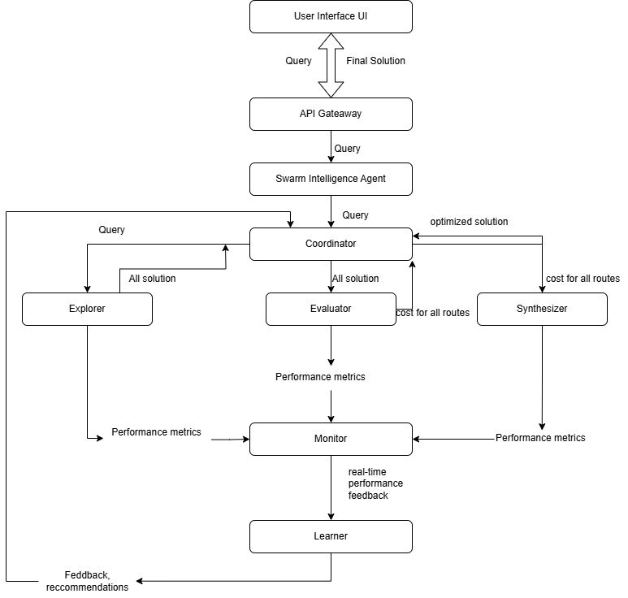

# 🚀 Swarm Intelligence System Design

## 📌 Overview
This project implements a **Swarm Intelligence Agent** to dynamically **fetch, evaluate, and optimize solutions** in real-time using **adaptive learning**.

### 🔹 Features:
- **Non-Colinear Execution** → Independent agents for parallel processing.
- **Real-World Data Integration** → Fetches live cost, time, and risk metrics.
- **Reinforcement Learning (RL) Adaptation** → ML-based weight optimization.
- **Continuous Feedback Loop** → Adaptive learning from real-time feedback.
- **Scalability** → Uses **Redis (caching)**.

---

## 📊 **System Design**
The system is composed of several key components:

### 🏗 **Architecture**
1. **User Interface (UI)** → Accepts user queries and displays final results.
2. **API Gateway** → Routes user queries to the Swarm Intelligence Agent.
3. **Swarm Intelligence Agent** → Manages the workflow and delegates tasks.
4. **Coordinator** → Allocates tasks and resources to worker agents.
5. **Worker Agents**:
   - **Explorer** → Fetches all possible solutions.
   - **Evaluator** → Ranks solutions based on multiple criteria.
   - **Synthesizer** → Combines the best-ranked solutions into a final output.
6. **Monitor** → Tracks agent performance and sends real-time feedback.
7. **Learner** → Uses feedback to improve the strategies of worker agents.
8. **Redis (Caching Layer)** → Stores intermediate results for fast lookups.

---

### **High-Level System Design**


### 📌 **Flow Diagram**
Below is the visual representation of the **Swarm Intelligence System**:




---

## 🛠 **Technology Stack**
| **Component**               | **Technology**                                  |
|-----------------------------|-------------------------------------------------|
| **User Interface (UI)**     | Streamlit                                       |
| **API Gateway**             | FastAPI                                         |                    
| **Swarm Intelligence Agent**| Python                                          |
| **Coordinator**             | Python                                          |
| **Explorer**                | Pathfinding algorithms, Random search           |
| **Evaluator**               | Scikit-learn, custom evaluation functions       |
| **Synthesizer**             | Custom optimization algorithms                  |
| **Monitor**                 | Python (for tracking performance)               |
| **Learner**                 | Reinforcement Learning (Q-learning, etc.)       |
| **Redis**                   | In-memory caching for solutions and sessions    |

---

## ⚙️ **How It Works**
1. **User Query** → Sent to the **API Gateway**.
2. **API Gateway** → Routes it to the **Swarm Intelligence Agent**.
3. **Swarm Intelligence Agent** → Delegates tasks to **Coordinator**.
4. **Coordinator**:
   - Sends the query to the **Explorer** (fetches possible solutions).
   - Sends solutions to the **Evaluator** (ranks them based on criteria).
   - Sends the **ranked results** to the **Synthesizer** (creates final output).
5. **Monitor** tracks agent performance and provides **real-time feedback**.
6. **Learner** uses this feedback to optimize agent strategies over time.
7. **Redis** caches solutions to prevent redundant computations.
8. **Final Optimized Solution** is sent back to the **User Interface**.

---

## 🚀 **Setup Instructions**
### 1️⃣ **Clone the Repository**
```sh
git clone https://github.com/your-repo/swarm-intelligence.git
cd swarm-intelligence
