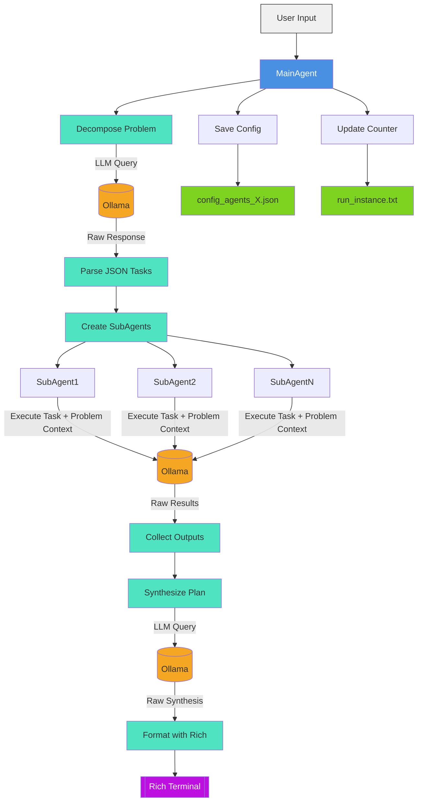

```mermaid
graph TD
    A[User Input] --> B[MainAgent]
    B --> C[Decompose Problem]
    C -->|LLM Query| D[(Ollama)]
    D -->|Raw Response| E[Parse JSON Tasks]
    E --> F[Create SubAgents]
    F --> G[SubAgent1]
    F --> H[SubAgent2]
    F --> I[SubAgentN]
    G -->|Execute Task + Problem Context| J[(Ollama)]
    H -->|Execute Task + Problem Context| J
    I -->|Execute Task + Problem Context| J
    J -->|Raw Results| K[Collect Outputs]
    K --> L[Synthesize Plan]
    L -->|LLM Query| M[(Ollama)]
    M -->|Raw Synthesis| N[Format with Rich]
    N --> O[[Rich Terminal]]
    B --> P[Save Config]
    B --> Q[Update Counter]
    P --> R[config_agents_X.json]
    Q --> S[run_instance.txt]

    classDef user fill:#f0f0f0,stroke:#333;
    classDef agent fill:#4a90e2,color:white;
    classDef process fill:#50e3c2;
    classDef storage fill:#7ed321;
    classDef llm fill:#f5a623;
    classDef output fill:#bd10e0,color:white;

    class A user;
    class B agent;
    class C,E,F,K,L,N process;
    class G,H,I subprocess;
    class D,J,M llm;
    class R,S storage;
    class O output;

```
