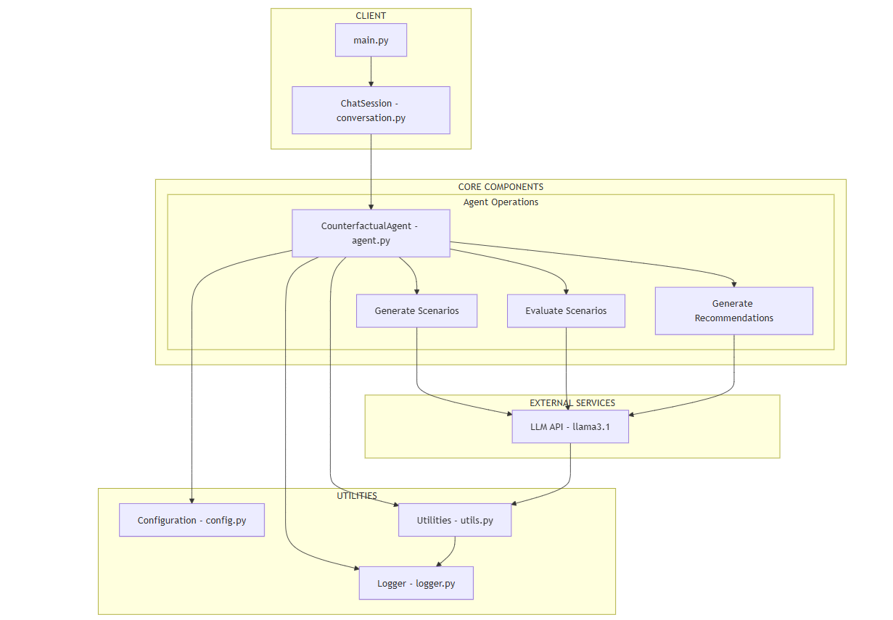
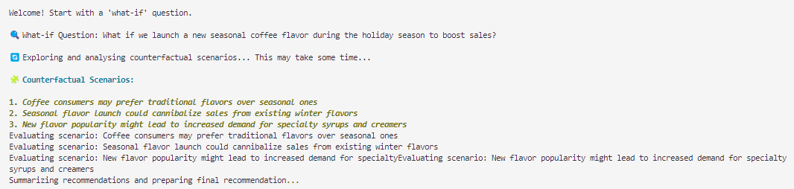
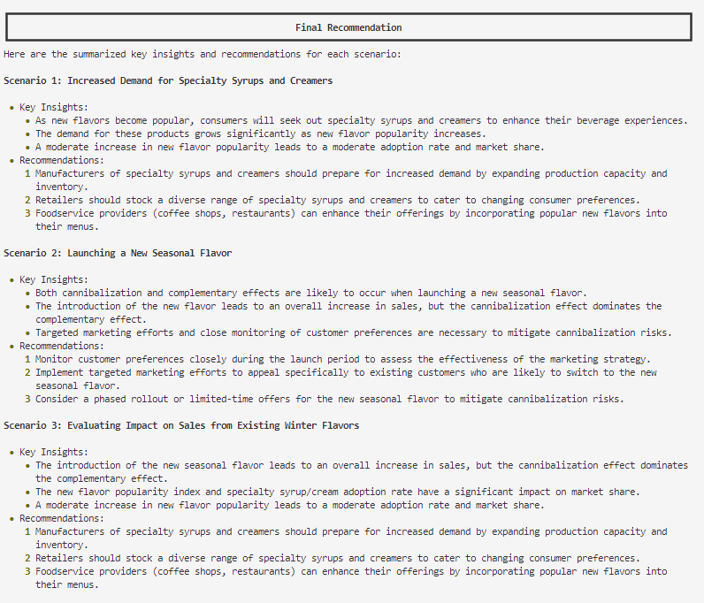
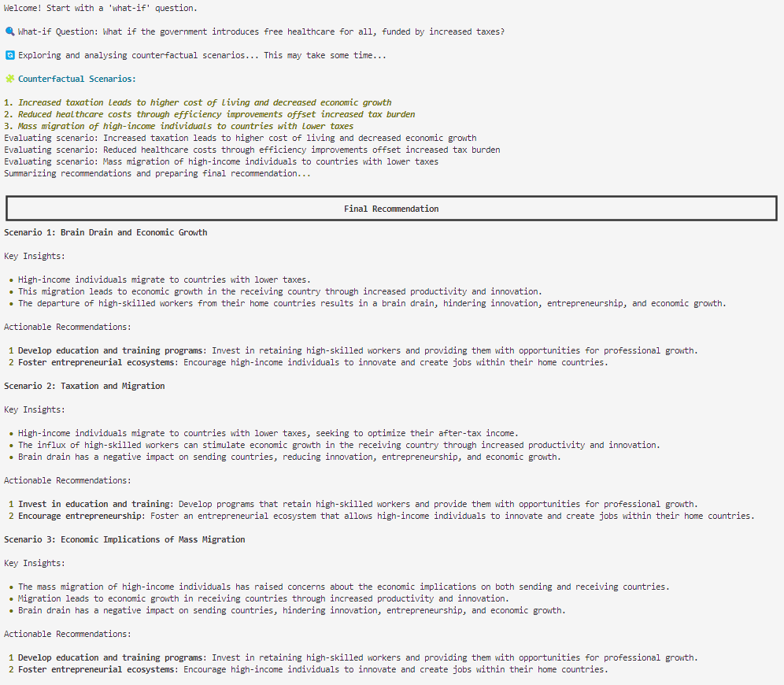
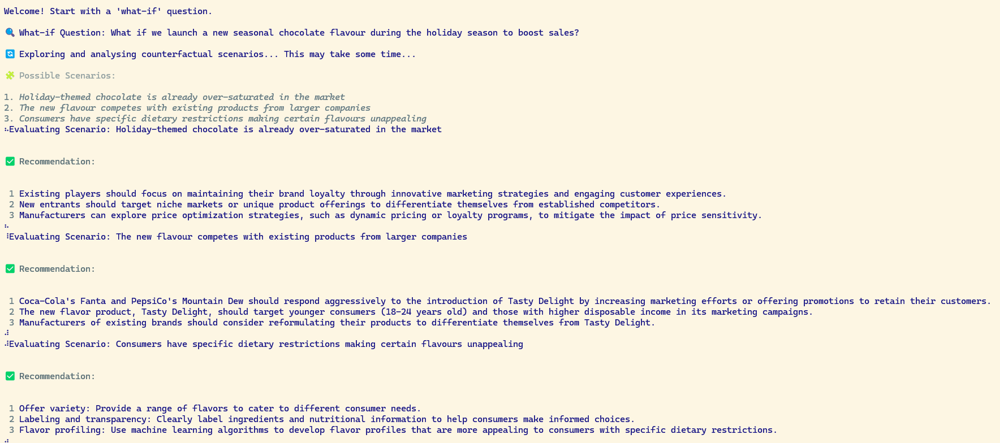

# 🚀 Counterfactual Reasoning Agent  

A powerful **Counterfactual Reasoning Agent** that explores **"what-if" scenarios** using **LLMs (Large Language Models)**. It generates alternative outcomes, evaluates their impact, and provides a final recommendation.  

## 🎯 Features  
✅ **Generates Counterfactual Scenarios** – Explore multiple "what-if" situations  
✅ **Evaluates Alternative Outcomes** – Uses logical reasoning and probabilistic models  
✅ **Provides Actionable Recommendations** – Summarizes key insights for decision-making  
✅ **Robust Error Handling** – Retries API calls and ensures valid JSON responses  
✅ **Modular & Extensible** – Clean architecture with separate files for different responsibilities  

---

## 🏗️ Project Structure  
```
counterfactual_agent/
│── img/                # contains images for the repo
│── src/
    │── config.py           # Configuration settings
    │── agent.py            # Core class implementation
    │── logger.py           # Logging and markdown rendering utilities
    │── llm_api.py          # LLM API calling logic
    │── scenario.py         # Scenario generation and evaluation logic
    │── utils.py            # Utility functions like JSON validation
    │── conversation.py     # Used for session creation
│── main.py             # Main entry point to run the agent
│── requirements.txt    # Dependencies 
│── README.md           # Project documentation
```

---

## System Design
### High Level Architecture


### Low-level System Design



---

## 🚀 Installation & Setup  

### 1️⃣ Clone the Repository  
```sh
git clone https://github.com/yaminimanral/StellisLabs-Agents.git
cd Yamini Manral/counterfactual_agent
```

### 2️⃣ Create a Virtual Environment (Recommended)  
```sh
python3 -m venv venv
 # On Mac use: source venv/bin/activate 
 # On Windows use: venv\Scripts\activate
```

### 3️⃣ Install Dependencies  
```sh
pip install -r requirements.txt
```

---

## 🎯 Usage  
### Run the Counterfactual Agent  
```sh
python main.py
```

### Example Scenario:  
If you set your question as:  
👉 **"What if we increase the marketing budget by 20% for our new product launch?"**  

🔍 The agent will:  
1. Generate alternative "what-if" scenarios  
2. Evaluate the possible outcomes  
3. Provide a recommendation for each scenario 

---

## 🛠️ Configuration  
Modify `config.py` to adjust settings:  
```python
COST_THRESHOLD = 15  # Max API calls  
TIME_LIMIT = 1200  # Execution time limit (in seconds)  
MAX_SCENARIOS = 3  # Number of counterfactuals to generate  
LLM_API_URL = "http://localhost:11434/api/generate"  # API endpoint  
```

---

## 📦 Dependencies  
This project requires Python 3.8+ and the following libraries:  
```
requests
rich
tenacity
```

---

## 💡 Output 

### Example 1:



### Example 2:


### Example 3:



---
## 🔮 Future Enhancements  
🔹 Support for **multiple LLM APIs**  
🔹 **Interactive UI** for scenario analysis  

---

## ✍🏻 Author
🔸 Developed by **Yamini Manral**  
🔸 For queries, contact: **manral.y@northeastern.edu**  
 
---

## 📝 License  
This project is licensed under the **MIT License**.  

💬 **Feedback & Contributions Welcome!** 🎉  
