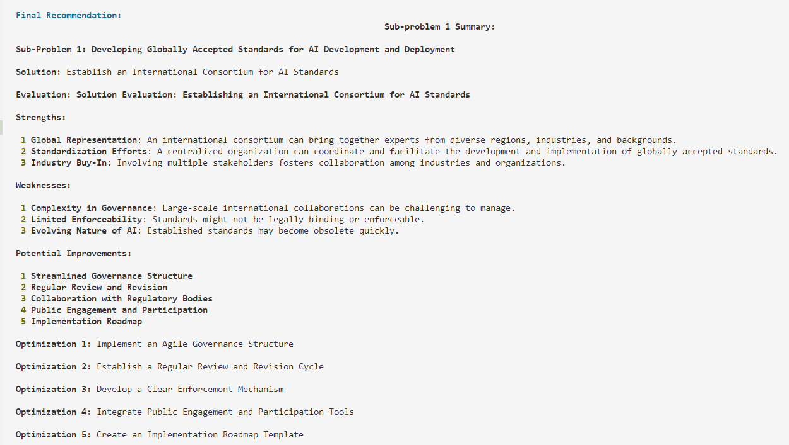

# 🧠 Fractal Reasoning Agent

A powerful tool that breaks down complex problems into manageable sub-problems, solving them systematically through a fractal reasoning approach.

## 🚧 Development Status
**Note:** This project is currently under active development. This is an early version with core functionality implemented. Additional features, improvements, and extensive testing will be added in future releases. Documentation may be incomplete, and interfaces are subject to change.

## 📋 Overview

Fractal Reasoning Agent is a CLI application that helps users solve complex problems by:
- Breaking down the main question into smaller sub-problems
- Generating solutions for each sub-problem
- Evaluating those solutions critically
- Optimizing the solutions based on evaluations
- Integrating everything into a cohesive final recommendation

## ✨ Features

- 🔍 **Problem Decomposition**: Automatically breaks down complex problems into actionable sub-problems
- 💡 **Solution Generation**: Creates specific solutions for each identified sub-problem
- ⚖️ **Critical Evaluation**: Analyzes strengths and weaknesses of each proposed solution
- 🔧 **Solution Optimization**: Enhances solutions based on critical evaluation
- 🔄 **Integration**: Combines all insights into a comprehensive final solution
- 🎨 **Rich Text Interface**: Provides a visually appealing and easy-to-read output format

## 🚀 Installation

```bash
# Clone the repository
git clone https://github.com/yourusername/fractal-reasoning-agent.git
cd fractal-reasoning-agent

# Create a virtual environment (optional but recommended)
python -m venv venv
source venv/bin/activate  # On Windows: venv\Scripts\activate

# Install dependencies
pip install -r requirements.txt
```

## 🔧 Prerequisites

- Python 3.8+
- Local LLM server running on http://localhost:11434 (compatible with Ollama)
- Internet connection for LLM API access

## 📝 Usage

Run the application with:

```bash
python main.py
```

The application will:
1. Prompt you to enter a complex question
2. Break down your question into sub-problems
3. Work through solution generation, evaluation, and optimization
4. Present a final integrated recommendation
5. Exit automatically after completion

To exit manually at any time, simply type `bye` when prompted for input.

## ⚙️ Configuration

You can customize the behavior by modifying `src/config.py`:

- `COST_THRESHOLD`: Maximum number of API calls allowed (default: 15)
- `TIME_LIMIT`: Maximum time for execution in seconds (default: 1200)
- `MAX_SCENARIOS`: Maximum number of sub-problems to generate (default: 3)
- `LLM_API_URL`: URL for the LLM API (default: "http://localhost:11434/api/generate")

## 📁 Project Structure

```
fractal-reasoning-agent/
├── main.py                  # Application entry point
├── requirements.txt         # Project dependencies
├── logfile.txt              # Log file (generated when running)
└── src/
    ├── agent.py             # Core reasoning agent implementation
    ├── config.py            # Configuration parameters
    ├── conversation.py      # User interaction handling
    ├── llm_api.py           # LLM API interaction
    └── logger.py            # Logging utilities
```

## 🔄 Workflow

1. **Decomposer**: Breaks down the main problem into sub-problems
2. **Solver**: Generates solutions for each sub-problem
3. **Evaluator**: Critically assesses each solution
4. **Optimizer**: Improves solutions based on evaluations
5. **Integrator**: Combines all insights into a comprehensive final solution
6. **Communicator**: Presents the final recommendation to the user


## 📸 Output




## 🔮 Future Developments
Planned enhancements for future releases include:

- Web interface for improved user experience
- Support for more LLM providers
- Persistent conversation history
- Advanced visualization of reasoning paths
- User feedback incorporation into the reasoning process
- Enhanced error handling and recovery mechanisms

## 📜 License

[MIT](LICENSE)

## 🤝 Contributing

Contributions are welcome! Please feel free to submit a Pull Request.

## 📧 Contact

For questions or feedback, please open an issue on the GitHub repository.
